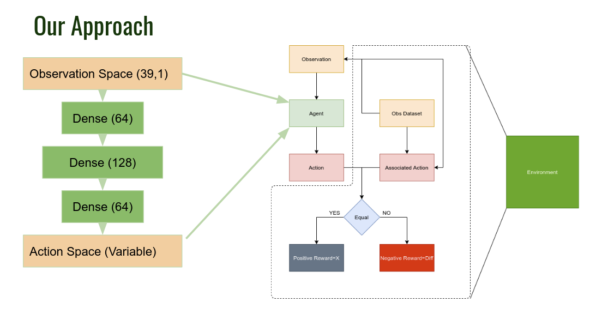
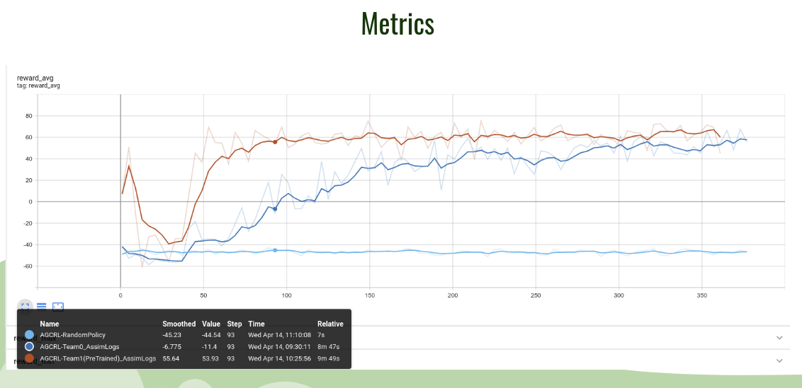
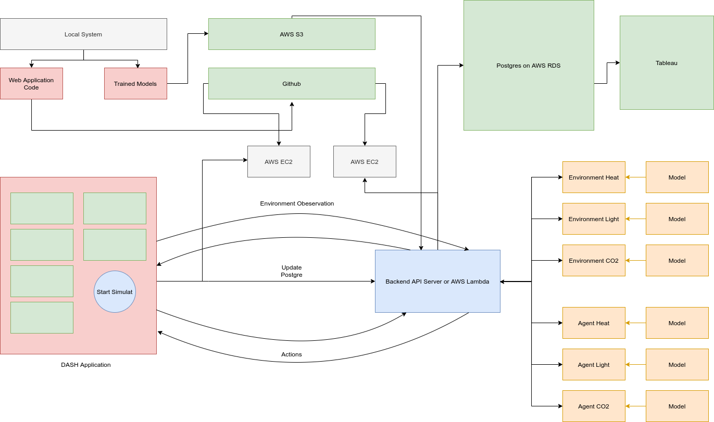
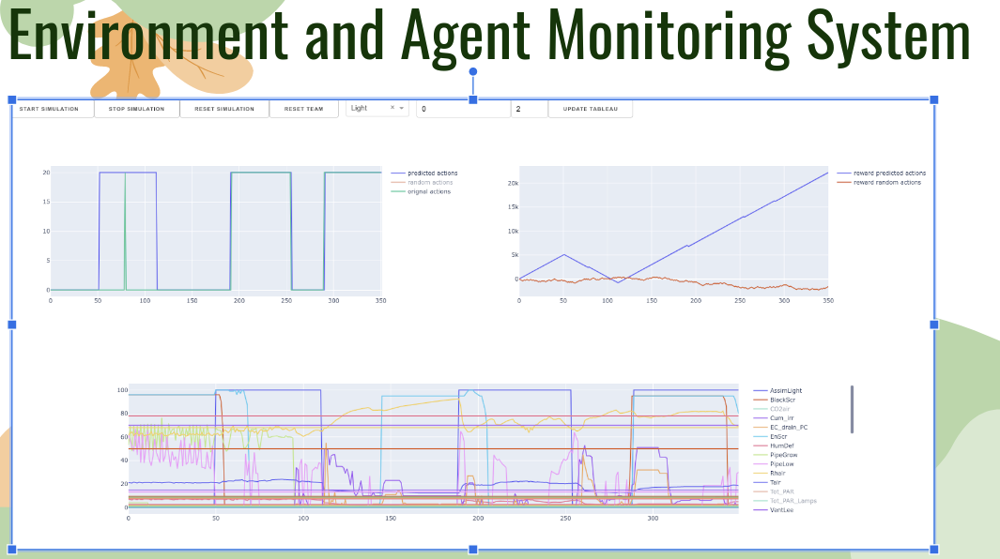
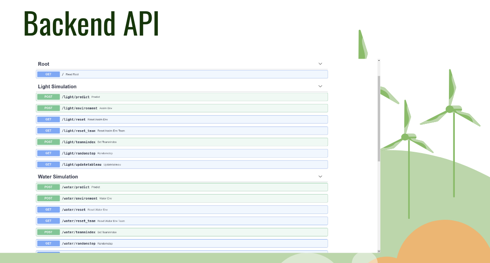
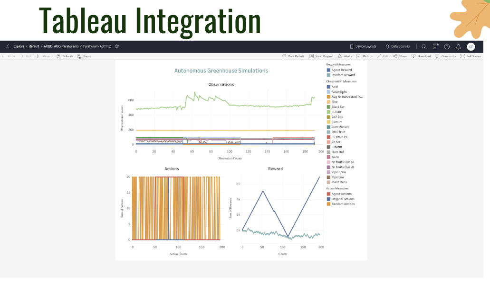

# Autonomous Greenhouse Control and Monitoring

Reinforcement Learning Approach Tried On AGC 2.0 Data

# What is AGC RL ?

Find our pitch presentation in [Presentation](./AOBD_AutonomousGreenhouseControl.pdf)

Find our description doc in [Presentation](./AGCDescriptionDoc.pdf)

The stated definition of our Project is the tryst of Agriculture with Reinforcement Learning. For this, the selected dataset is Autonomous Greenhouse Challenge. The purpose of using this dataset is to create an RL environment that indeed focuses on how a plantation knowledge of tomato crops can be encoded into an AI algorithm and based on that, automate decisions just like humans. This indeed helps to understand the growing patterns of tomato crop in changing weather conditions and other contributing factors significantly affecting the same.

## Contributors
- [Kaushal Patil](https://github.com/Kaushal1011)
- [Arpitsinh Vaghela](https://github.com/arpitvaghela)
- [Pathik Patel](https://github.com/pathikpatel-ml)
- [Vyoma Patel](https://github.com/nerdyvyoma136)

## Problem statement

The main idea here is how to understand and automatically control the quality of cherry tomatoes by considering different parameters like temperature, air, water supply, light, etc.

# Research & Devlopment

We formulated the following approach to train our RL agent based on the Autonomous Greenhouse Challenge Dataset.

## Our Approach

## Tensorboard & Monitoring Rewards

# What We Built

We built the following things and integrated them as a complete simulation control and monitoring solution

1. Environment and Agent based on approach specified: Tensorflow, Pandas, Numpy
2. Backend API that interacts with Environment and Agent: FastAPI, Pydantic, Tensorflow, AWS EC2
3. Tableau Integration: PostgreSQL, psycopg2, AWS RDS
4. Dashboard for controlling simualation and monitoring environment: Dash Python ( Flask, React, Plotly), AWS EC2
5. Continuos Integration for newly trained models: Boto3, AWS S3

## Our Pipeline

## Dashboard for controlling simulation and monitoring environment

## Environment and Agent

- Shown above
  
## Backend API

## Tableau Integration

# More Info

- All of our research work can be found in [Notebooks directory](/notebooks).(Some notebooks might need changing code where paths are involved as they have been moved later after running)
- Our FastAPI backend can be found in [API](./AGC_API)
- Dashboard is based on Dash code in [Dash](./dashFe/app.py)
- [Presentation](./AOBD_AutonomousGreenhouseControl.pdf)
